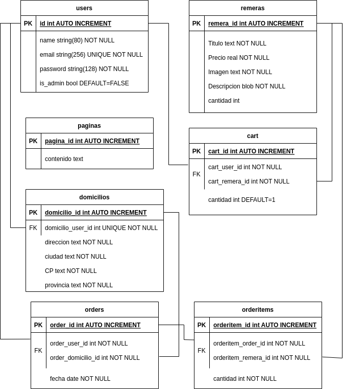

# **Documentación de Frikio**

### ​ **Índice**

1. Introducción
2. Instalación
3. Arquitectura y Tecnología
4. Organización del proyecto
5. Diagrama de base de datos
6. Funcionamiento de la aplicación

## ​1. INTRODUCCIÓN

El objetivo principal de esta aplicación de comercio electrónico es crear una plataforma de venta en línea dedicada a la comercialización de remeras estampadas. Nuestro enfoque es ofrecer a los clientes una amplia variedad de diseños que reflejen sus gustos y personalidades. La aplicación permitirá a los usuarios explorar, seleccionar y comprar remeras con diseños únicos y auténticos.

**Público Objetivo:**

La audiencia a la que nos dirigimos incluye hombres y mujeres con edades comprendidas entre 15 y 35 años. Estamos enfocados en atraer a personas interesadas en la moda creativa y la expresión personal a través de su ropa. Nuestra tienda se esfuerza por atraer a individuos que buscan diseños únicos y auténticos para complementar su estilo.

## ​2. INSTALACIÓN

**Configuración de un Entorno de Desarrollo Local**

Para configurar un entorno de desarrollo local y probar la aplicación de comercio electrónico desde el repositorio de GitHub, sigue estos pasos:

**Descarga del Repositorio de GitHub:**

Clona el repositorio de GitHub en tu sistema local.

**Creación de un Entorno Virtual:**

Cambia al directorio del proyecto:

cd Frikio

Crea un entorno virtual para aislar las dependencias del proyecto:

python -m venv venv

Activa el entorno virtual:

En Windows:

venv\Scripts\activate

En macOS y Linux:

source venv/bin/activate

**Instalación de Dependencias:**

Dentro del entorno virtual, instala las dependencias requeridas utilizando pip

pip install -r requirements.txt

Esto instalará las bibliotecas y paquetes necesarios para ejecutar la aplicación.

**Base de Datos SQLite:**

La aplicación utiliza SQLite como base de datos por defecto. La base de datos SQLite ya está configurada en el proyecto, por lo que no es necesario realizar ningún paso adicional para la configuración de la base de datos.

**Ejecución de la Aplicación:**

flask run.py

La aplicación estará disponible en http://127.0.0.1:5000/ en tu navegador web. Puedes comenzar a explorar y probar la aplicación en tu entorno de desarrollo local.

Este proceso te permitirá configurar un entorno de desarrollo local con la aplicación de comercio electrónico desde GitHub y ejecutarla con una base de datos SQLite. Recuerda que este es un entorno de prueba, y deberás configurar una base de datos más robusta en un entorno de producción si es necesario.

## ​3. ARQUITECTURA Y TECNOLOGÍA

El stack tecnológico utilizado en esta aplicación de comercio electrónico está diseñado para ser eficiente, escalable y fácil de mantener. A continuación, detallamos las tecnologías y herramientas clave utilizadas en este proyecto:

### ​Lenguaje de Programación: Python 3.9

Python 3.9 se elige como el lenguaje de programación principal para el desarrollo de la aplicación. Python es conocido por su legibilidad y facilidad de uso, lo que lo convierte en una elección popular para el desarrollo web.

### ​Framework Flask

Flask es un microframework de desarrollo web de código abierto para Python que permite construir aplicaciones web, servicios web y APIs de manera sencilla y rápida. Sus principales características incluyen su simplicidad y flexibilidad, lo que lo hace ideal para desarrolladores que desean crear aplicaciones web sin una curva de aprendizaje empinada. Algunas de sus características destacadas son su naturaleza micro, extensibilidad, el uso de Jinja2 para renderizar páginas web, enrutamiento de URL, capacidad de desarrollo rápido y una activa comunidad de desarrolladores.

### ​Plantillas HTML: Jinja2

Jinja2 es un motor de plantillas utilizado por Flask para generar documentos HTML. Permite la incorporación de datos dinámicos en las plantillas HTML.

### ​Framework CSS: Bootstrap

Bootstrap es un framework CSS que agiliza la creación de sitios web y aplicaciones móviles atractivas y adaptables. Desarrollado por Twitter, ofrece estilos, componentes y diseños predefinidos para un desarrollo web más rápido. Su principal ventaja radica en la capacidad de adaptar automáticamente las interfaces a diferentes dispositivos, mejorando la experiencia del usuario. Además, proporciona una variedad de componentes listos para usar, como botones y formularios, facilitando la creación de interfaces coherentes. Las ventajas de Bootstrap incluyen su diseño adaptable, consistencia visual, facilidad de uso, amplia comunidad, personalización, compatibilidad con navegadores y actualizaciones regulares.

# ​4. ORGANIZACIÓN DEL PROYECTO

Cuando trabajas en un proyecto un poco más complicado, un solo archivo puede volverse confuso. Se deben definir clases para modelos y formularios, y se mezclarán con el script de tus rutas y configuración. Todo esto puede ralentizar el desarrollo. Para resolver este problema, podemos separar las diferentes partes de nuestra aplicación en un conjunto de módulos que trabajan juntos. A esto se le llama paquetes.

Frikio

├── requiriments.txt

├── run.py

└── app/

└── \_\_init\_\_.py

└── forms.py

└── models.py

└── routes.py

└── static/

└── templates/

└── instance/

└── frikio.db

requiriments.txt: Este archivo es esencial para la gestión de dependencias de Python. Contiene una lista de todas las bibliotecas y paquetes necesarios para ejecutar la aplicación.

run.py: Se encarga de iniciar la aplicación Flask y se utiliza para ejecutar la aplicación web.

app/: Este es el directorio que contiene la aplicación en Flask

\_\_init\_\_.py: Este archivo es necesario para que Python trate el directorio "app" como un paquete. Inicializa y configura la aplicación. Es el punto de entrada de la aplicación.

routes.py: Se definen las rutas y las funciones controladoras de las vistas web. Esto establece la lógica de cómo se manejan las solicitudes de los usuarios y qué se muestra en respuesta.

models.py: Los modelos de datos y las funciones para manejar la lógica del negocio.

static/ Este directorio contiene archivos CSS, JavaScript e imágenes.

templates/ Plantillas que utiliza Jinja2 para generar el HTML.

frikio.db La base de datos sqlite de la aplicación

## ​SQLAlchemy

SQLAlchemy es una librería para Python que facilita el acceso a una **base de datos relacional** , así como las operaciones a realizar sobre la misma. Además SQLAlchemy es un un ORM (Object Relational Mapper) que brinda a los desarrolladores de aplicaciones toda la potencia y flexibilidad de SQL.

### ​¿Qué es un ORM?

Un ORM (de sus siglas en inglés, Object Relational Mapper), es una librería que permite manipular las tablas de una base de datos como si fueran objetos de nuestro programa.

Lo más habitual es que una tabla se corresponda con una clase, cada fila de una tabla con un objeto (o instancia de una clase), las columnas de una tabla con los atributos de una clase y las claves ajenas (o Foreign Keys) con relaciones entre clases (definidas también a partir de atributos).

La siguiente imagen muestra la correspondencia entre los elementos de una base de datos y las clases y objetos de un programa:

## ​V  entajas de usar un ORM

Algunas ventajas de usar un ORM, como SQLAlchemy, son:

- Acceder a tablas y filas de una base de datos como clases y objetos.
- Eliminación de la necesidad de utilizar SQL en la mayoría de los casos, ya que el ORM se encarga de las traducciones.
- Independencia de la base de datos, permitiendo cambiar de motor con pocos cambios en la aplicación.
- Incremento de la productividad del desarrollador.
- Compatibilidad con una variedad de bases de datos relacionales, como PostgreSQL, MySQL y Sqlite.

## ​Gestor de base de datos SQLite

SQLite es un gestor de bases de datos relacional con un enfoque diferente a gestores como MySQL o PostgreSQL. A diferencia de otros gestores, SQLite tiene como objetivo formar parte integral de la aplicación en lugar de funcionar como un sistema cliente-servidor independiente. Algunos ejemplos de su uso incluyen navegadores como Firefox, Opera y Chrome, la aplicación de comunicaciones Skype, sistemas operativos como Android e iOS, y muchas otras aplicaciones.

SQLite se encuentra en una amplia variedad de dispositivos, desde Android e iOS hasta Mac y Windows 10, colaborando en el almacenamiento de datos para aplicaciones desarrolladas en varios lenguajes, como Python, Java, C y C++. Es un proyecto de código abierto y su sitio oficial es sqlite.org. Para comenzar a utilizarlo, se puede instalar una aplicación como SQLite Browser, que permite aprender los comandos del gestor de base de datos y luego acceder a él desde aplicaciones desarrolladas en Python, Java, entre otros.

Con el gestor de base de datos SQLite, una base de datos siempre es un único archivo. Con dicho gestor podemos crear/modificar/eliminar nuestra base de datos, crear las tablas de forma gráfica o a través del lenguaje SQL y cargar datos.

##

## ​5. DIAGRAMA DE LA BASE DE DATOS

A continuación se encuentra el diagrama de entidad-relación (ER) de la base de datos:

Este diseño de base de datos permite gestionar las páginas web, las remeras disponibles para la venta, los usuarios, los carritos de compras, las direcciones de envío y las órdenes de compra en una aplicación de comercio electrónico. Los diferentes modelos y relaciones entre ellos facilitan la gestión de datos y la interacción de los usuarios con la aplicación.

**Paginas** : Almacena contenido de páginas web con identificadores únicos.

**Remeras** : Registra información de remeras disponibles, como título, precio, imagen, descripción y cantidad en stock.

**Users** : Contiene datos de usuarios, como nombre, correo electrónico, contraseña y estado de administrador.

**Cart** : Gestiona carritos de compras de usuarios con detalles de los productos y cantidades.

**Domicilios** : Almacena direcciones de envío de usuarios, incluyendo dirección, ciudad, código postal y provincia.

**Orders** : Registra órdenes de compra de usuarios con referencias al usuario y dirección de envío.

**OrderItems** : Detalla los productos en cada orden, incluyendo el producto, la cantidad y la orden a la que pertenecen.

## ​6. FUNCIONAMIENTO DE LA APLICACIÓN

1. **init.py** : Este archivo es el punto de entrada de la aplicación. En él, se configura la aplicación Flask, se define la estructura de la base de datos, y se establece una clave secreta para seguridad. También se configura el manejo de sesiones y el sistema de autenticación de usuarios.
2. **forms.py** : Aquí se definen los formularios de registro e inicio de sesión de la aplicación. Estos formularios permiten a los usuarios registrarse e iniciar sesión de manera segura. Los formularios están diseñados para validar los datos de entrada del usuario.
3. **models.py** : Este archivo contiene la definición de las tablas de la base de datos que se utilizarán en la aplicación. Las tablas incluyen información sobre páginas, remeras, usuarios, carrito de compras, domicilios y pedidos. Además, este archivo define cómo se relacionan las tablas entre sí.
4. **routes.py** : Aquí se definen las rutas (URLs) de la aplicación y las funciones asociadas a cada una de ellas. Por ejemplo, hay rutas para la página de inicio, para ver remeras individuales, para el registro de usuarios, para iniciar sesión, para ver el carrito de compras, para agregar o eliminar elementos del carrito, entre otras. Las rutas se encargan de mostrar las páginas web y de gestionar las interacciones de los usuarios.

En resumen, esta aplicación utiliza Flask para construir un sitio web de comercio electrónico. Los usuarios pueden registrarse, iniciar sesión, explorar una lista de remeras, ver detalles de productos individuales y agregar productos a su carrito de compras. La aplicación también permite a los usuarios gestionar su carrito de compras y realizar pedidos. Los datos se almacenan en una base de datos SQLite. Flask facilita la creación de rutas web y la gestión de sesiones, mientras que las plantillas HTML se utilizan para diseñar las páginas web que se muestran a los usuarios.
